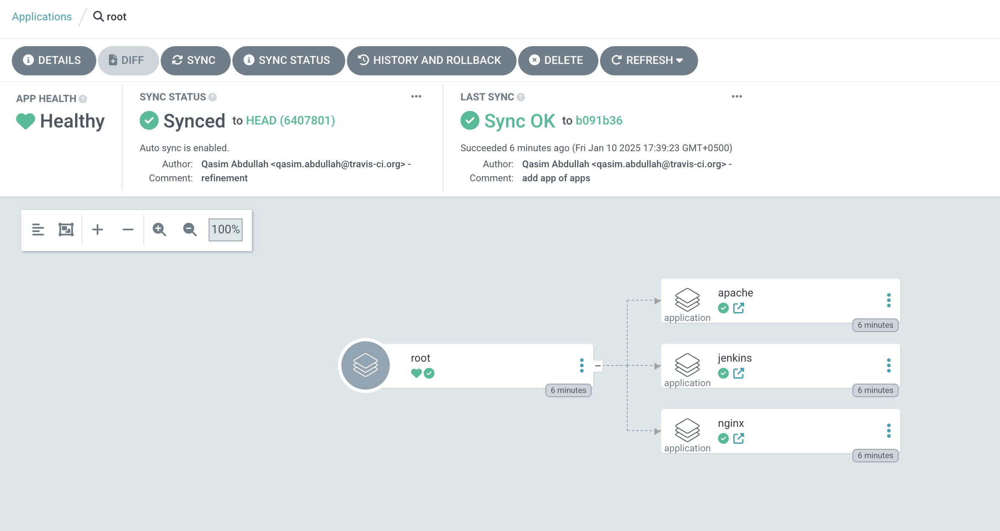

# GitOps

## Spin Kubernetes Cluster

* `minikube start --kubernetes-version=v1.28.12 --cni=calico --network-plugin=cni --memory=6G --cpus=3`

## Get the code

`git clone https://github.com/qasim-at-tci/gops.git`

## ArgoCD Installation

* `kubectl create namespace argocd`
* `helm install --values ./argo-cd/values.yaml argocd ./argo-cd --namespace argocd`

## App of Apps
* `kubectl create ./app.yaml`

